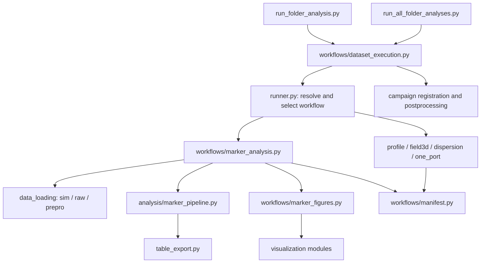

# Analysis code map

The two command-line entrypoints share one dataset execution policy. Numerical
analysis, figure rendering, campaign metadata, and batch scheduling have separate
owners. The original public `runner.run_folder_analysis()` remains available for
code that needs the basic analysis without campaign postprocessing.



## Where to change behavior

| Responsibility | Owner |
| --- | --- |
| Single-dataset arguments, path resolution, terminal output | `run_folder_analysis.py` |
| Dataset discovery, worker pool, failure collection, final campaign refresh | `run_all_folder_analyses.py` |
| Shared marker correction and campaign follow-up policy | `workflows/dataset_execution.py` |
| Select the workflow from category and file formats | `runner.py` |
| Load each S-parameter folder once, build/save standard tables | `workflows/marker_analysis.py` |
| Choose and render standard figure groups | `workflows/marker_figures.py` |
| Direct Y11 and Z11 exports | `workflows/one_port.py` |
| Scientific calculations | `analysis/` and `markers/` |
| CSV filenames, columns, and transactional saving | `table_schema.py`, `table_export.py` |
| Output manifest and existing-file lookup | `workflows/manifest.py` |
| S11 render identity | `workflows/figure_cache.py` |

Package paths in this table are relative to `deflector_tuning/` unless they name
a root script. Workflow selection preserves category gates and the existing
profile/field3d/dispersion detection order. Standard analysis still produces the
13 tables in `STANDARD_TABLE_SPECS`; direct Y11/Z11 workflows use their own table
contracts. The `f_mean` marker remains excluded from nodal-shift target errors.

## Single and batch policy

`run_dataset_analysis()` performs marker correction, core analysis, campaign
registration, and enabled campaign postprocessing. Both entrypoints use it.
The batch runner keeps one plot worker per dataset to avoid nested process pools.

For a matched campaign, plunger sensitivity tables are generated when a
phase-offset sensitivity reference is configured. Its figures are omitted in
tables-only mode. Simulation comparison requires `comparison_enabled` and figure
rendering; tuning-state phase summaries also require figure rendering. The batch
runner refreshes campaign summaries after its tasks complete.

Campaign comparison can invoke the lower-level `runner.run_folder_analysis()`
for reference simulations. Keeping campaign policy above that runner avoids
recursive campaign processing and circular imports.

## Polar figures and campaign metadata

Polar figures are organized by responsibility:

- `polar_grouping.py`: group marker rows and construct labels.
- `polar_plot_plans.py`: select ordered output plans without creating figures.
- `polar_drawing.py`: draw positions, labels, and shared annotations.
- `polar_overlays.py`: draw family and Kyhl overlays.
- `polar_phase_views.py`: validate, apply style, render plans, and save figures.

Campaign metadata lives under `campaigns/`: `models.py` defines typed records,
`config.py` parses YAML, `validation.py` checks relationships and paths, and
`discovery.py` matches datasets. `tuning_campaign.py` explicitly re-exports the
existing public classes and functions, so callers retain their import paths.

## S11 cache rules

Grid S11 figures are reused only when every recorded image exists and the saved
signature matches current loaded S11 values, marker rows, effective plot settings,
package source, and numerical/plotting library versions. Hashing uses bounded
DataFrame chunks and the already-loaded table; it does not reopen raw data.
Scientific tables are recomputed on each run.

Older manifests without a signature trigger a full S11 redraw on the next normal
run. Tables-only mode retains existing image references and their original render
signature; it never assigns a new signature to old images. If a group is missing
an image, its signature is dropped so a later full run reconstructs the group.
Other figure groups keep their existing rendering policies.

## Tests and maintenance

- `test_runner.py`: public path resolution and analysis-mode detection.
- `test_runner_standard.py`: standard analysis integration and figure dispatch.
- `test_runner_branches.py`: category gates and alternative workflows.
- `test_runner_cache.py`: one load per run, reuse, invalidation, tables-only.
- `test_dataset_execution.py` and CLI tests: shared single/batch campaign policy.
- `test_figure_cache.py`: numerical/configuration/code identity and missing files.
- `test_polar_phase_views.py`: rendering behavior and pure output planning.
- `test_tuning_campaign*.py`: configuration, discovery, and campaign workflows.

Run the full suite from the repository root:

```powershell
$env:PYTHONDONTWRITEBYTECODE='1'
$env:MPLBACKEND='Agg'
python -m pytest -q -p no:cacheprovider
```

The tools under `scripts/` remain independent entrypoints for focused scientific
views, validation metrics, conversion, and Touchstone port manipulation. Reusable
calculations and rendering belong in the package; command-line parsing belongs
in the scripts. A script's absence from the main runner does not make it obsolete.
